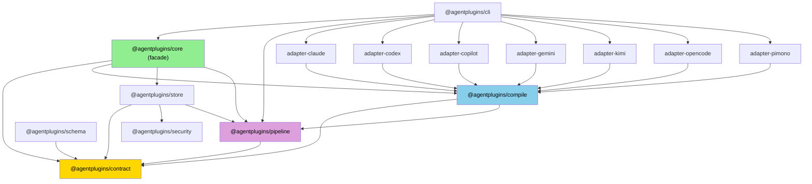
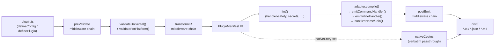
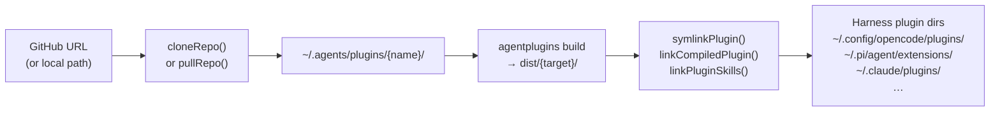

# Architecture

AgentPlugins is a **ports-and-adapters (hexagonal) compiler pipeline**.

Two orthogonal axes:

- **Capability axis** (hooks/commands/continueWith/…) — *layered*: modeled once in `contract`, emitted via the shared `compile` kernel. Cross-cutting capabilities hit every target, so the kernel handles them once.
- **Target axis** (claude/codex/opencode/pimono/…) — *sliced*: each `adapter-*` is a self-contained vertical slice over the kernel, declaring only its event-name table and target config.

This is deliberately *not* vertical-slice architecture for capabilities: slicing a compiler vertically per capability duplicates the pipeline. The pain of multiple drifting contracts is cured by a shared kernel and a single contract, not by slicing.

---

## Package dependency graph

Dependencies flow inward — inner rings are more stable.



**Allowed dependency directions (inward only):**


| Package     | Single responsibility                                                                   | Allowed deps                               |
| ----------- | --------------------------------------------------------------------------------------- | ------------------------------------------ |
| `contract`  | Zod schema → TS types → JSON Schema. The single source of truth for the manifest model. | `zod`                                      |
| `pipeline`  | Middleware kernel: Plugin, Middleware, contexts, createApp(). No business logic.        | `contract`                                 |
| `compile`   | Shared codegen kernel: emit helpers, sanitizers, lint, validation, hook-wrapper.        | `contract`, `pipeline`                     |
| `store`     | Fetch / install / link / fs isolation. Registry, symlink fanout, doctor.                | `contract`, `security`, `pipeline`         |
| `schema`    | Re-exports generated JSON Schema artifacts from `contract` build step.                  | `contract`                                 |
| `security`  | Safe-fetch, integrity verification, script-policy. No plugin dependencies.              | —                                          |
| `adapter-*` | Target config + event-name table + calls to kernel helpers.                             | `compile` (→ `contract`)                   |
| `core`      | Re-export facade. Public API is unchanged; internal origin moves to sub-packages.       | `contract`, `compile`, `store`, `pipeline` |
| `cli`       | Build/add/install/link commands, tty output.                                            | `core`, `pipeline`, `adapter-*`            |


---

## Plugin bus (`@agentplugins/pipeline`)

Every pipeline stage is middleware over a shared context with `next()`. Built-in adapters, lint rules, and emitters are registered as default `Plugin` objects; power users compose additional ones via `defineConfig`.

```ts
// agentplugins.config.ts
import { defineConfig } from '@agentplugins/core';
import myAdapter from './adapters/my-harness.js';

export default defineConfig({
  manifest: { name: 'my-plugin', version: '1.0.0', description: '...' },
  plugins: [
    {
      name: 'my-harness',
      adapter: myAdapter,                  // contributes a compile target
      transformIR: async (ctx, next) => {  // mutates the manifest IR before emit
        ctx.manifest = { ...ctx.manifest, /* your transforms */ };
        await next();
      },
    },
  ],
  targets: ['claude', 'my-harness'],
});
```

`Plugin` interface (from `@agentplugins/pipeline`):

| Field          | Stage           | Purpose                                  |
| -------------- | --------------- | ---------------------------------------- |
| `adapter`      | compile         | Contribute a compile target              |
| `lintRules`    | preValidate     | Add build-time checks                    |
| `emitters`     | compile         | Add code-generation languages            |
| `preValidate`  | before IR       | Validate or reject the manifest          |
| `transformIR`  | after validate  | Mutate the PluginManifest IR             |
| `postEmit`     | after compile   | Inspect/rewrite emitted files per-target |
| `onInstall`    | install         | Gate or transform install steps          |
| `onAudit`      | audit           | Run custom audit checks                  |

`TargetPlatform` is now an open string type — built-in ids keep autocomplete, custom ids are valid as long as a matching adapter is registered.

---

## Compile pipeline

Plugin source → universal IR → per-target files.



**Key emit invariants (enforced in `compile` kernel, not per-adapter):**

- `emitCommandHandler(cmd)` — emits as a quoted string array; never uses template-literal interpolation; never passes `shell: true`.
- `emitInlineHandler(fn)` — serializes via `.toString()` once, in the kernel. Adapters call this helper rather than serializing directly.
- `sanitizeName(name)` — rejects `..`, absolute paths, non-kebab characters. Used for plugin names and SKILL.md frontmatter names.
- `sanitizeJoin(base, untrusted)` — resolves `path.join(base, untrusted)` then asserts the result starts with `base`. Used for `nativeCopies.from/to`.

---

## Distribute pipeline

Source → fetch → install → link → harness discovers plugin.



**Store invariants:**

- Plugin store root: `~/.agents/plugins/<sanitized-name>/`
- Pre-install wipes all previous links (compiled + skills + native + symlink) via `unlinkAll()`.
- Symlink operations use `lstatSync` before `unlinkSync`; never call `rmSync(recursive)` on real directories.
- Install on a repo declaring a denylist lifecycle script → blocked before `cloneRepo`.

---

## Adapter port contract

Every `adapter-*` implements `PlatformAdapter` (defined in `contract`):

```typescript
interface PlatformAdapter {
  readonly name: TargetPlatform;
  readonly displayName: string;
  readonly supportedHooks: readonly UniversalHookName[];
  readonly supportedHandlers: readonly HandlerType[];
  readonly manifestPath: string;
  readonly manifestFormat: 'json' | 'toml';

  validate(plugin: PluginManifest): ValidationIssue[];
  compile(plugin: PluginManifest): AdapterOutput;
}
```

Adapters declare **only**:

1. `HOOK_MAPPING: Partial<Record<UniversalHookName, string>>` — universal → target event name
2. `validate()` — target-specific constraint checks (delegates to `compile` kernel)
3. `compile()` — calls kernel helpers to emit files; must not contain raw `shell: true` or string interpolation into commands

The kernel (`compile`) owns all security-sensitive emit logic. Adapters are thin mappings.