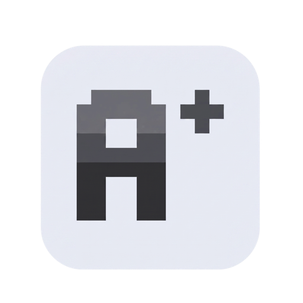

# AgentPlugins

<p align="left">
  <picture>
    <source media="(prefers-color-scheme: dark)" srcset="./docs/public/img/logo-dark.png" />
    
  </picture>
</p>

<p align="left">
  <a href="https://github.com/sigilco/agentplugins/blob/main/LICENSE"></a>
  <a href="https://www.npmjs.com/package/@agentplugins/cli"></a>
  <a href="https://www.npmjs.com/package/@agentplugins/cli"></a>
  <a href="https://github.com/sigilco/agentplugins/actions/workflows/ci.yml"></a>
</p>

> Write AI agent plugins once, ship to any harness.

<p align="center">
  
</p>

## Why

- **Write once, run everywhere** — one manifest compiles to Claude Code, Codex, OpenCode, Pi, Copilot, Gemini, and Kimi
- **Universal codegen first, per-harness fallback second** — Tier-1 harnesses get full parity; Tier-2 gets skills + commands + a subset of hooks
- **No runtime proxy** — every adapter emits the harness's native output format; no shim layer, no lock-in
- **Honest capability matrix** — capability gaps emit `WARN` at compile time and surface on the [capability matrix page](https://agentplugins.pages.dev/guide/capability-matrix)
- **Plays nicely with what you already have** — install a plugin into a harness that already has its own plugins; they coexist

Install any plugin into every supported AI agent — **Tier-1:** Claude Code, Codex, OpenCode, Pi. **Tier-2:** Copilot, Gemini, Kimi.

```bash
npx @agentplugins/cli add user/awesome-plugin
```

```bash
agentplugins add sigilco/agentplugins-ponytail
```

Or install the CLI globally first:

```bash
curl -fsSL https://agentplugins.pages.dev/install.sh | bash
```

## Quick start

From zero to a working plugin in any supported harness:

```bash
# Scaffold a new plugin from the official template
npx @agentplugins/cli init my-plugin
cd my-plugin

# Install it into every supported harness (writes to ~/.claude, ~/.codex, etc.)
npx @agentplugins/cli add .

# Verify the install landed where you expect
npx @agentplugins/cli doctor
```

## Create a plugin

Scaffold a plugin from a template, write your manifest, build, and publish to GitHub:

```bash
agentplugins init
agentplugins build
```

Full guide → [agentplugins.pages.dev/guide/creating-plugins](https://agentplugins.pages.dev/guide/creating-plugins)

Porting an existing plugin? → [agentplugins.pages.dev/guide/porting](https://agentplugins.pages.dev/guide/porting)

## Supported agents

**Tier-1** (full capability parity): Claude Code, Codex, OpenCode, Pi.

**Tier-2** (skills + commands, subset of hooks): Copilot, Gemini, Kimi.

Capability comparison → [agentplugins.pages.dev/guide/capability-matrix](https://agentplugins.pages.dev/guide/capability-matrix)

## Architecture

One manifest → seven adapters. Each adapter owns its output format; the `@agentplugins/core` compiler routes capability expressions to harness-native primitives and emits a WARN for any gap.

Full detail → [ARCHITECTURE.md](./ARCHITECTURE.md)

## Documentation

Full docs → [agentplugins.pages.dev](https://agentplugins.pages.dev)

LLMs.txt for AI agents → [agentplugins.pages.dev/llms.txt](https://agentplugins.pages.dev/llms.txt)

## Contributing

PRs welcome. See [CONTRIBUTING.md](./CONTRIBUTING.md), file issues, and join the conversation in [Discussions](https://github.com/sigilco/agentplugins/discussions).

---

Apache-2.0 · [GitHub](https://github.com/sigilco/agentplugins) · [Sponsor](https://buy.polar.sh/polar_cl_Mv1gdlG7bw3I70EC9IHtfeSHJj4PEKvA7JAUz23CFhj)
