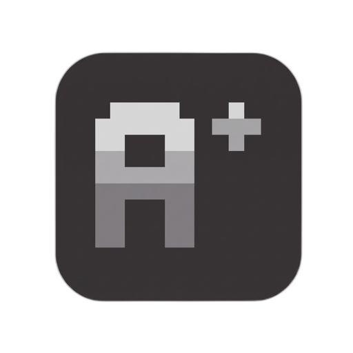

# AgentPlugins

<p align="left">
  <picture>
    <source media="(prefers-color-scheme: dark)" srcset="./docs/public/img/logo-light.png" />
    
  </picture>
</p>

> Write AI agent plugins once, ship to any harness.

Install any plugin into every supported AI agent with one command — Claude Code, Codex, Copilot, Gemini, Kimi, OpenCode, and Pi Mono.

```bash
curl -fsSL https://agentplugins.pages.dev/install.sh | bash
```

Or run ad-hoc with `npx`:

```bash
npx @agentplugins/cli add user/awesome-plugin
```

```bash
agentplugins add sigilco/agentplugins-ponytail
```

## Create a plugin

Scaffold a plugin from a template, write your manifest, build, and publish to GitHub:

```bash
agentplugins init
agentplugins build
```

Full guide → [agentplugins.pages.dev/guide/creating-plugins](https://agentplugins.pages.dev/guide/creating-plugins)

Porting an existing plugin? → [agentplugins.pages.dev/guide/porting](https://agentplugins.pages.dev/guide/porting)

## Supported agents

Works with Claude Code, Codex, Copilot, Gemini, Kimi, OpenCode, and Pi Mono.

Capability comparison → [agentplugins.pages.dev/guide/capability-matrix](https://agentplugins.pages.dev/guide/capability-matrix)

## Documentation

Full docs → [agentplugins.pages.dev](https://agentplugins.pages.dev)

LLMs.txt for AI agents → [agentplugins.pages.dev/llms.txt](https://agentplugins.pages.dev/llms.txt)

---

Sponsor AgentPlugins → [buy.polar.sh/polar_cl_Mv1gdlG7bw3I70EC9IHtfeSHJj4PEKvA7JAUz23CFhj](https://buy.polar.sh/polar_cl_Mv1gdlG7bw3I70EC9IHtfeSHJj4PEKvA7JAUz23CFhj)

Apache-2.0 · [GitHub](https://github.com/sigilco/agentplugins)
