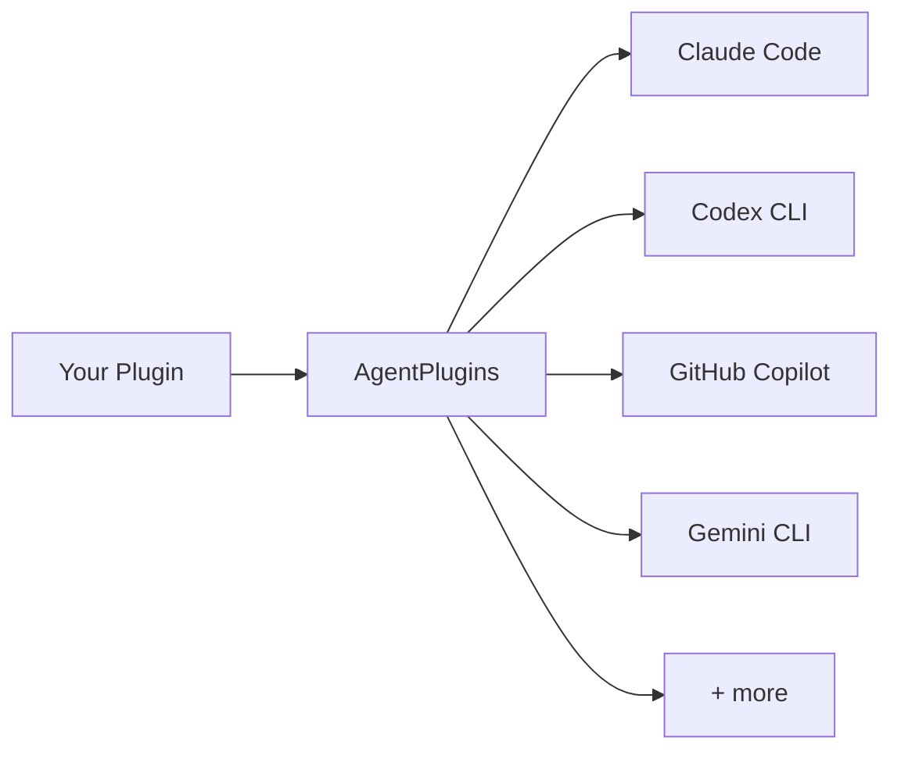

# Introduction

AgentPlugins is a toolchain for AI agent plugins. Write a plugin once, ship it to every supported agent harness from a single manifest.

## The problem

Every AI agent framework ships its own plugin system with its own manifest format, hook lifecycle, and handler conventions:

| Framework          | Manifest                     | Handler types         |
| ------------------ | ---------------------------- | --------------------- |
| Claude Code        | `.claude-plugin/plugin.json` | command, http, prompt |
| Codex CLI          | `.codex-plugin/plugin.json`  | command only          |
| GitHub Copilot CLI | `plugin.json`                | command, http, prompt |
| Gemini CLI         | `gemini-extension.json`      | command only          |
| Kimi               | `kimi.plugin.json`           | command only          |
| OpenCode           | TypeScript plugins           | inline only           |
| Pi Mono            | TypeScript extensions        | inline only           |

**Seven frameworks, seven different APIs.** A plugin author who wants reach across the ecosystem maintains seven forks of the same logic. Users who switch harnesses lose every plugin they configured.

## The solution

AgentPlugins introduces a **universal manifest** ([`agentplugins.config.ts`](/guide/manifest)) and a **universal store** (`~/.agents/plugins/`). You declare hooks, skills, tools, MCP servers, and commands once. The CLI compiles that manifest down to each platform's native format and symlinks the result into every detected agent.

## Supported platforms

AgentPlugins targets four harnesses as primary compile targets with universal codegen — the same plugin behaviour across all four:

| Agent       | Binary     | Skill path                  |
| ----------- | ---------- | --------------------------- |
| Claude Code | `claude`   | `~/.claude/skills`          |
| Codex CLI   | `codex`    | `~/.codex/skills`           |
| OpenCode    | `opencode` | `~/.config/opencode/skills` |
| Pi Mono     | `pi`       | `~/.pi/extensions`          |

Three additional harnesses are tracked with decreasing capability coverage:

| Agent              | Binary    | Skill path          |
| ------------------ | --------- | ------------------- |
| GitHub Copilot CLI | `copilot` | `~/.copilot/skills` |
| Gemini CLI         | `gemini`  | `~/.gemini/skills`  |
| Kimi               | `kimi`    | `~/.kimi/skills`    |

See the [agent paths reference](/reference/agent-paths) for the full registry and the [adapters reference](/reference/adapters) for what each platform emits.

## Custom harnesses

If you maintain an internal harness, you can add it as a custom compile target. Register a private adapter via the `plugins` field in `defineConfig` — see [Extending the Build Pipeline](/guide/extending) for the full guide.

## Where to go next

- [Install](/guide/installation) the CLI.
- Walk through the [quick start](/guide/quick-start).
- Learn the [manifest format](/guide/manifest).

